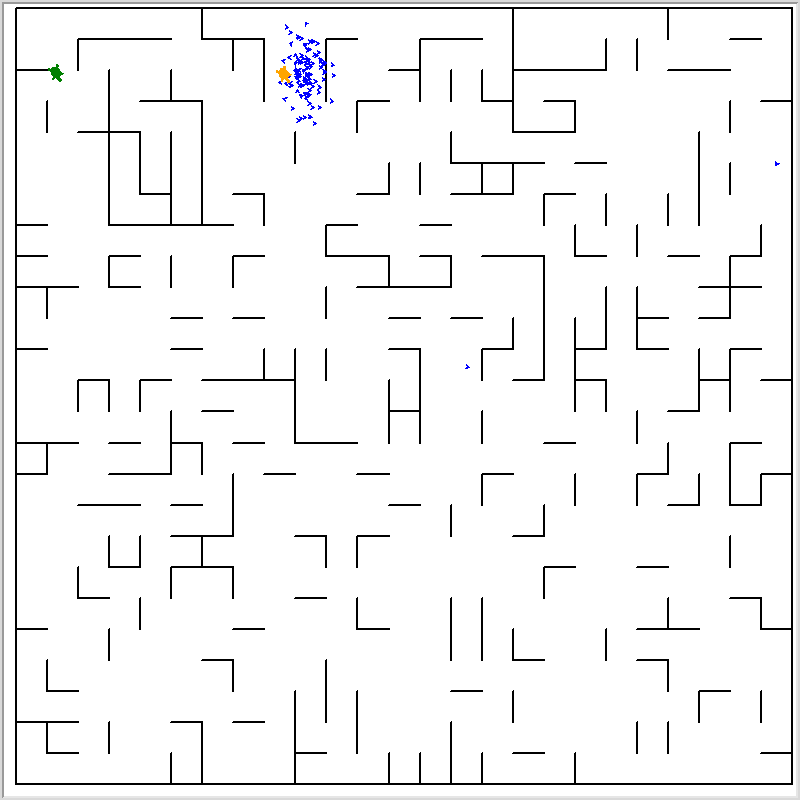
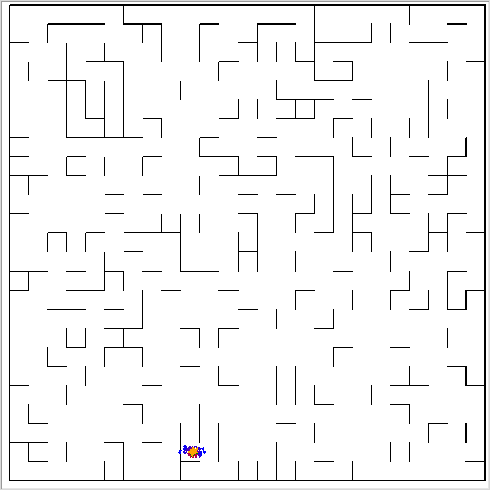

# Particle Filter

Lei Mao

University of Chicago

## Introduction

Particle filter is a Monte Carlo algorithm used to solve statistical inference problems. In this project, the turtle location in maze was infered using particle filter. The green turtle is the actual location while the orange turtule is the estimated location. The arrows are particles. Blue arrows stand for low probability particles while red arrows stand for high probability particles. There are four sensors installed on the front, back, left and right of the turtle. The sensors measure its perpendicular distances to the closest walls in four directions, possibly bounded by some sensor limit. 

Particle Filter Start | Particle Filter Equilibrated
:-------------------------:|:-------------------------:
  |   


## Files

```
.
├── LICENSE.md
├── main.py
├── maze.py
└── README.md
```

## Dependencies

* Python 3.6
* Numpy 1.14

## Usages

The following parameters could be adjusted for the particle filter.

```shell
$ python main.py --help
usage: main.py [-h] [--window_width WINDOW_WIDTH]
               [--window_height WINDOW_HEIGHT] [--num_particles NUM_PARTICLES]
               [--sensor_limit_ratio SENSOR_LIMIT_RATIO]
               [--grid_height GRID_HEIGHT] [--grid_width GRID_WIDTH]
               [--num_rows NUM_ROWS] [--num_cols NUM_COLS]
               [--wall_prob WALL_PROB] [--random_seed RANDOM_SEED]
               [--robot_speed ROBOT_SPEED] [--kernel_sigma KERNEL_SIGMA]
               [--particle_show_frequency PARTICLE_SHOW_FREQUENCY]

Particle filter in maze.

optional arguments:
  -h, --help            show this help message and exit
  --window_width WINDOW_WIDTH
                        Window width.
  --window_height WINDOW_HEIGHT
                        Window height.
  --num_particles NUM_PARTICLES
                        Number of particles used in particle filter.
  --sensor_limit_ratio SENSOR_LIMIT_RATIO
                        Distance limit of sensors (real value: 0 - 1). 0:
                        Useless sensor; 1: Perfect sensor.
  --grid_height GRID_HEIGHT
                        Height for each grid of maze.
  --grid_width GRID_WIDTH
                        Width for each grid of maze.
  --num_rows NUM_ROWS   Number of rows in maze
  --num_cols NUM_COLS   Number of columns in maze
  --wall_prob WALL_PROB
                        Wall probability of a random maze.
  --random_seed RANDOM_SEED
                        Random seed for random maze and particle filter.
  --robot_speed ROBOT_SPEED
                        Robot movement speed in maze.
  --kernel_sigma KERNEL_SIGMA
                        Sigma for gaussian distance kernel.
  --particle_show_frequency PARTICLE_SHOW_FREQUENCY
                        Frequency of showing particles on maze.
```

To run particle filter using default parameters, simply run the following command in terminal:

```shell
$ python main.py
```

## Demo

[Particle Filter in Maze](https://www.youtube.com/watch?v=NtXpJRQj3Pg&feature=youtu.be)


## References

[Particle Filter in Beacons](https://github.com/mjl/particle_filter_demo)


## Notes

I found that if the number of particles is not sufficiently large, particularly for some complicated environment, such as the maze which looks quite similar in many local regions, and when the sensor is not perfect, sometimes it will take much longer time, after many rounds of particle reinitializations, to get the right location of the turtle. So the number of particles is definitely the most important parameters for particle filter. However, it slows down the computations.

If the number of particles is not sufficiently large, sometimes adjusting the standard deivation of Gaussian kernel might make it converges faster.

Although theoretically it is true, it is amazing to see that the particle filter could infer the heading of turtle correctly even if the sensor measurements do not contain direction information directly.

## To-Do List

- [x] Remove compass from turtle.